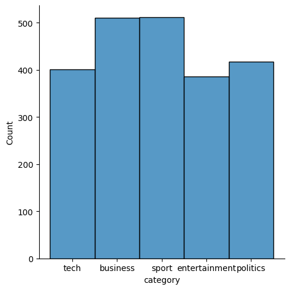
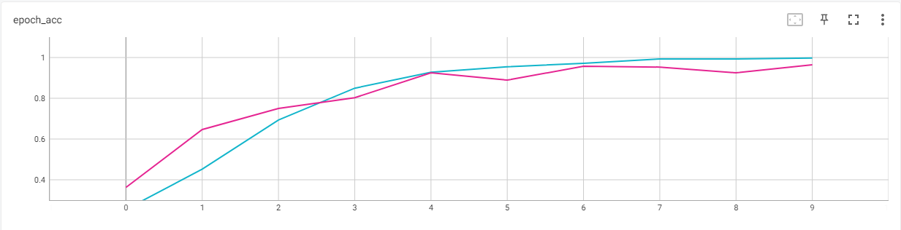
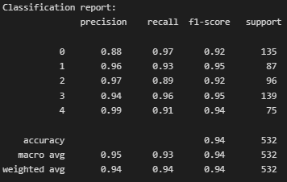
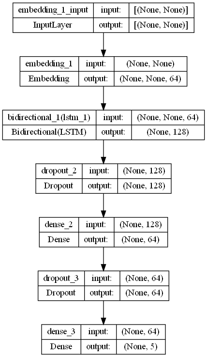

# Deep Learning Approach to Classify Article Into Various Categories Using LSTM
Since text documents are among the most comprehensive sources of data for businesses, they are a crucial component which are essential towards a business advancement. Text papers frequently include important information that could impact investment flows or shape market patterns. As a result, businesses frequently employ analysts to keep an eye on the trend through internet publications, tweets on social media sites like Twitter, or newspaper articles. Some businesses, however, might prefer to limit their attention to news about politics and technology. As a result, categorizing the articles into separate groups is absolutely necessary.

Often the categorization of the articles is conducted manually and after the fact which, often times, causes a waste of time and resources due to the huge effort needed. As such, this project is made to group previously uncategorized content into 5 categories: Sport, Technology, Business, Entertainment, and Politics.

A Bidirectional LSTM layer is chosen to be the main hidden layer for this project as it provides great results during both training and prediction. The model managed to score an average of 94% in F1-score and an accuracy of 94%.

## Steps Taken

### Step 1 - Data loading  

> The csv dataset obtained from [susanli2016](https://github.com/susanli2016/PyCon-Canada-2019-NLP-Tutorial) is loaded into the project using pandas.
  
### Step 2 - Data inspection  

> The dataset is checked during the inspection step for any NaN values, duplicates, and unnecessary information that needs to be removed. The dataset does not contain any NaN values but it does contain 99 duplicates that needed to be removed during the data cleaning step. The values in 'text' are mostly cleaned but they can be improved by filtering stopwords and applying lemmatization.

   
  Distribution of the article category in the dataset.

  

### Step 3 - Data cleaning  

> The duplicates are dropped to preserve the integrity of the data. The dataset is then lemmatized and filtered of all stopwords using functions from the **nltk** module. The dataset is also filtered of all symbols with **regex**.
  
### Step 4 - Features selection  

> The column that will be used in the model training is chosen and defined into a separate variable of features and targets.
 
### Step 5 - Data pre-preprocessing  

> The features of the dataset are tokenized with 5000 words and padding with 250 max length is set. The targets are encoded using the OneHotEncoder. The data is then split into training data and test data using 'train_test_split' from the **sklearn** module.

### Step 6 - Model development  

> A Sequential model is built with an Embedding layer as the input layer, followed by a Bidirectional LSTM layer with 64 nodes as the first hidden layer. A Dropout layer with a rate of 0.3 is then added, followed by a Dense layer with 64 nodes and another Dropout layer with the same rate of 0.3. The last layer added is a Dense layer with a softmax activation to act as an output layer. The data processed in the previous step is then fit into the model and the model is trained for 10 epochs. The training process of the model is monitored through TensorBoard.

   
  Accuracy changed during model training with the light blue line as training and the pink line as validation.

 

### Step 7 - Model evaluation  

> The model is evaluated with a classification report and the detailed results of the prediction made by the model are shown in the [Results](#results) section below.

### Step 8 - Model saving

> The tokenizer, encoder, and model are saved into its file to be loaded for deployment.

## Results
The classification report created with the prediction made by the model can be seen below. The model scored from 92% to 95% in F1-score and 94% in accuracy. The model managed to perform well even with the imbalanced amount of data between the 5 categories.

 

   
  Classification report for the prediction made by the model.

  

Further improvements can be made to the model by improving the lemmatization method used in the data cleaning steps. A subword tokenizer can also be considered for the data to improve the performance and efficiency of the model.

## Model Architecture

 

   

  

## Acknowledgement
A huge thanks to [susanli2016](https://github.com/susanli2016/PyCon-Canada-2019-NLP-Tutorial) for sharing the dataset used for this project!
